<div align="center">

# 🎙️ VoxAgent

**和你的编程智能体对话，它会开口回答。**

面向 Claude Code、Cursor、OpenClaw 及所有 MCP 客户端的本地优先语音交互层。

[](https://github.com/zanezhao0708/voxagent/actions/workflows/ci.yml)
[](LICENSE)
[](pyproject.toml)
[](https://modelcontextprotocol.io)

[English](README.md) · [简体中文](README_ZH.md)

</div>



## 为什么做这个

编程智能体已经从"补全工具"进化成"同事"，但交互方式还是键盘。
VoxAgent 给你的智能体装上**耳朵和嘴巴**：

- 🎤 **`listen()`** —— 口述需求、代码片段、评审意见
- 🔊 **`speak()`** —— 语音汇报进度；你可以去倒杯咖啡，智能体自己说
- 🗣️ **`ask_user()`** —— 智能体提问，你隔空口头回答
- 🕹️ **Push-to-talk** —— 全局热键按住说话，话音直通 `claude -p`，回复语音播报

一切都在**你自己的机器上**运行：语音识别完全离线（faster-whisper）；
语音合成默认零配置，可一键切换到本地 CosyVoice 获得高质量中文音色。
无需任何 API Key。

## 快速开始

```bash
pip install 'voxagent[local]'
voxagent doctor        # 检查麦克风与依赖
voxagent demo          # 独立体验对话回路

# 注册到 Claude Code
claude mcp add voxagent -- voxagent serve

# 启用 Agent Skill（教智能体什么时候该说话）
mkdir -p ~/.claude/skills && cp -r skills/voice-control ~/.claude/skills/

# Push-to-talk 守护进程（可选）：在任何应用里按住热键对 Claude Code 说话
pip install 'voxagent[ptt]'
voxagent ptt --send 'claude -p'
```

然后直接说：**"打开语音模式"**——或者按住 PTT 热键（默认 `Ctrl+Shift+Space`）开口即说。

任何 MCP 客户端（Cursor、OpenClaw、Codex 等）都可以接入。

## 架构

```
        ┌─────────────┐     MCP (stdio)      ┌──────────────────┐
 麦克风─▶│   listen()  │◀────────────────────▶│  Claude Code /   │
        │  (语音识别)  │                      │  Cursor / 任意   │
 扬声器◀─│   speak()   │◀────────────────────▶│  MCP 客户端      │
        │  (语音合成)  │     工具 + 技能       └──────────────────┘
        └─────────────┘
         faster-whisper    edge-tts / CosyVoice（可插拔）
         ▲ 完全离线                ▲ 环境变量一键切换
```

**引擎可插拔**，改一个环境变量即可换引擎：

| 层 | 默认 | 升级路径 | 配置 |
| --- | --- | --- | --- |
| 语音识别 | faster-whisper (`small`) | `medium` / `large-v3`、GPU | `WHISPER_MODEL`、`WHISPER_DEVICE` |
| 语音合成 | edge-tts（零配置） | 本地 CosyVoice 服务 | `VOXAGENT_TTS_ENGINE=cosyvoice` |
| 语言 | 自动检测 | 固定 `zh` / `en` ... | `VOXAGENT_LANGUAGE` |

全部选项见 [.env.example](.env.example)。

## MCP 工具

| 工具 | 作用 |
| --- | --- |
| `listen()` | 录音转文字。静音自动停止，VAD 过滤 |
| `speak(text)` | 文字转语音播放，返回时长（秒） |
| `ask_user(question)` | 说出问题，再采集口头回答 |

内置 **Agent Skill**（`skills/voice-control`）教会智能体*何时*使用这些工具：
语音回复要短、长任务前先语音预告、跟随用户语言、异常时优雅降级为文字。

## 路线图

- [x] Push-to-talk 全局热键（`voxagent ptt`）
- [ ] 流式识别（边说边出字）
- [ ] 声音记忆——克隆你自己的音色来播报
- [ ] OpenClaw / n8n 集成示例
- [ ] 内置 CosyVoice 的 Docker 镜像

## 参与贡献

欢迎 Issue 和 PR——尤其欢迎新引擎适配器（GPT-SoVITS、F5-TTS、Piper 等），
每个适配器约 40 行，参考 `voxagent/tts/cosyvoice_engine.py` 的写法。

## 许可证

[MIT](LICENSE)
